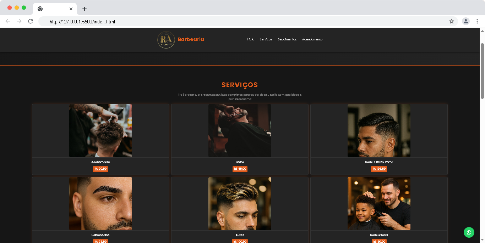
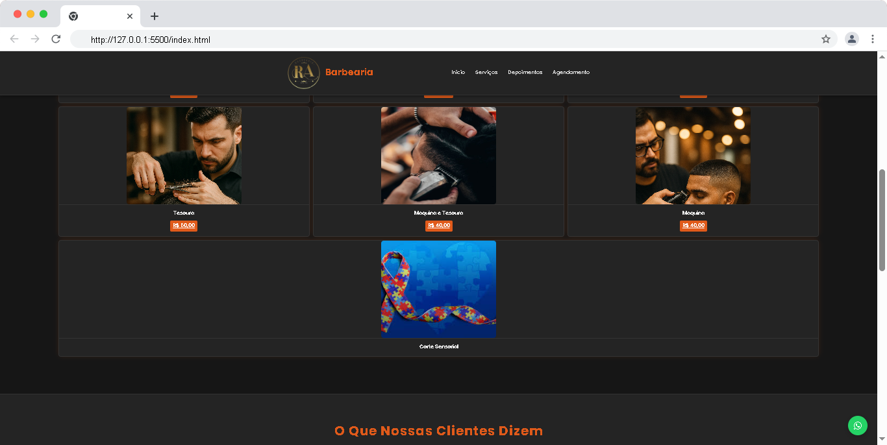
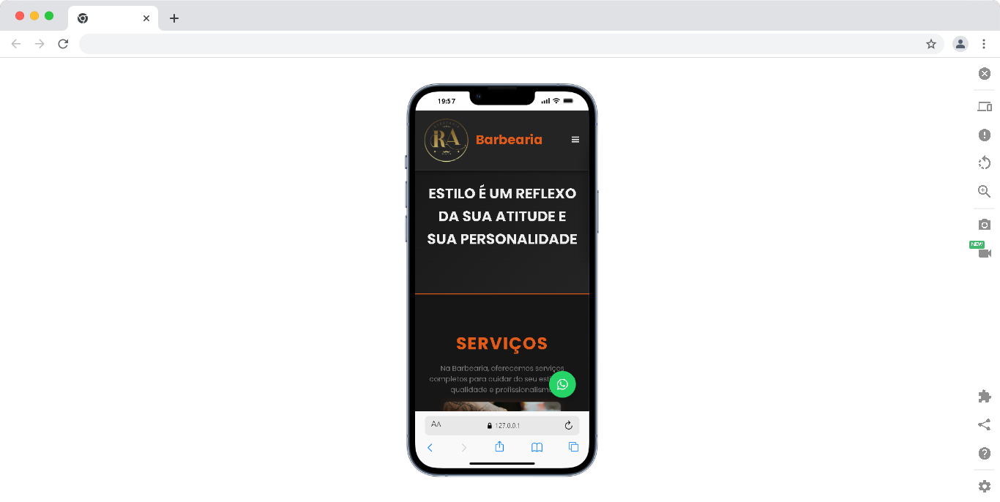

# 💈 Barbearia RA

Site institucional da Barbearia RA, desenvolvido com HTML, CSS e JavaScript.

## 📸 Preview

### 🖥️ Desktop

 

### 📱 Mobile

 

## 🔗 Acesse o site

> [👉 Acesse aqui para visualizar o projeto online ](https://lincolnneres.github.io/Barbearia---RA/)

## 🛠️ Tecnologias

- HTML5
- CSS3
- JavaScript

## 📋 Funcionalidades

- Página inicial com hero section
- Seção de serviços e cortes
- Depoimentos de clientes
- Agendamento via WhatsApp
- Modal de agendamento com horários
- Design responsivo mobile

## 🎨 Identidade Visual

Paleta **Dark Industrial** — grafite escuro com laranja ferrugem.

## 👨‍💻 Autor

Desenvolvido por Lincoln Neres
